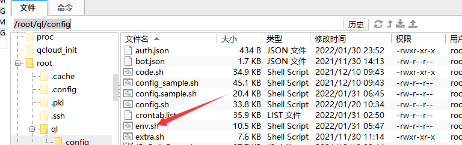

# 青龙部署

### 官方教程
:point_right: [查看Telegram频道](https://t.me/jiao_long/31)

### 【新手推荐】青龙稳定版一键配置（QL pannel Faker Repository environment Setup）[原文参考链接](https://thin-hill-428.notion.site/QL-pannel-Faker-Repository-environment-Setup-45edcbfe90d74d8abb2d71896eab3be7)

* 感谢@OreoMeow 大佬贡献配置

* 最新版青龙有可能造成脚本无法运行的情况，请使用一键脚本安装亲测稳定青龙版本。

* 本脚本功能：安装docker 安装2.10.13青龙+青龙端口更改（可选）+CK提交版Ninja（可选）

* 教程系统：Cent OS 7.6


```bash
yum update -y

wget -q https://raw.githubusercontents.com/shufflewzc/VIP/main/Scripts/sh/ql.sh -O ql.sh && bash ql.sh
```

> 已有青龙保存CK办法，下载env.sh到本地后再进行安装,安装完成后在环境变量一次性复制添加，打开自动拆分即可。



### 使用说明

1、重置Cent OS 7.6系统 

2、SSH输入代码

3、需要更改青龙端口的按提示操作，不需要的一直按回车

### 已安装青龙2.10.13的用户，一键拉库

```bash
docker exec -it qinglong bash -c "$(curl -fsSL https://git.metauniverse-cn.com/https://github.com/shufflewzc/VIP/blob/main/Scripts/sh/1customCDN.sh)"
```

### 本地电脑

<CodeGroup>
<CodeGroupItem title="Mac" active>

  ```bash
  # 新建ql目录
  mkdir ql

  # 在ql目录下新建 config log db repo raw scripts
  cd ql && mkdir config log db repo raw scripts

  # 创建容器，`latest` 可以换为指定版本，比如 2.10.13
  docker run -dit -v /ql/config:/ql/config -v /ql/log:/ql/log -v /ql/db:/ql/db -p 5700:5700 --name qinglong --hostname qinglong --restart always whyour/qinglong:latest
  ```

  </CodeGroupItem>
  <CodeGroupItem title="Windows">

  ```bash
  # 假设目录是在D盘下
  docker run -dit -v d:/ql/config:/ql/config -v d:/ql/log:/ql/log -v d:/ql/db:/ql/db -p 5700:5700 --name qinglong --hostname qinglong --restart always whyour/qinglong:latest

  # 多容器
  docker run -dit -v d:/bh/config:/ql/config -v d:/bh/log:/ql/log -v d:/bh/db:/ql/db -p 6700:5700 --name baihu --hostname baihu --restart always whyour/qinglong:2.10.13
  ```

  </CodeGroupItem>
</CodeGroup>

### 解决青龙白屏问题
<CodeGroup>
  <CodeGroupItem active title="一键脚本">

```bash
# 进入青龙容器 
docker exec -it qinglong bash
# 执行一键脚本
bash <(curl -ls https://gitee.com/suiyuehq/ziyong/raw/master/ql_cdn/v2.10.13/bpxf.sh)
```

  </CodeGroupItem>
  <CodeGroupItem title="手动">

```bash
# 1. 登陆linux 
# 2. 进入青龙容器 
docker exec -it qinglong bash
# 3. 备份原来的index.html文件防止改错了不可用 
cp dist/index.html dist/index.html.bak
# 4. 替换cdn
# 语法格式
sed -i "s/要查找的文本/替换后的文本/g" `grep -rl "要查找的文本" ./`
sed -i "s/cdn.jsdelivr.net/cdn.ravi.cool/g" /ql/dist/index.html
# 替换两个不一样的文件名
sed -i "s/darkreader.min.js/darkreader.js/g" /ql/dist/index.html
sed -i "s/codemirror.min.js/codemirror.js/g" /ql/dist/index.html
# 5. 登陆青龙面板查看是否解决
```

  </CodeGroupItem>
</CodeGroup>

### 解决青龙黑ip

```bash
## 青龙代理
ALL_PROXY="你的Socket5代理或者http代理"
export ALL_PROXY=$ALL_PROXY
echo '当前代理:' $ALL_PROXY
# 日志输出ip
echo '👇查询公网IP👇'
# curl --silent --location --request GET 'https://ifconfig.me/'
curl --silent --location --request GET 'https://cip.cc/'
echo -e '\n'
```