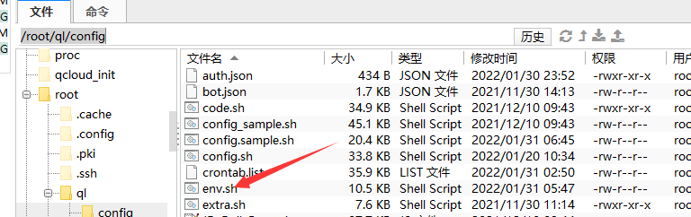

# 青龙部署

### 官方教程
:point_right: [查看Telegram频道](https://t.me/jiao_long/31)

### 【新手推荐】青龙稳定版一键配置（QL pannel Faker Repository environment Setup）[原文参考链接](https://thin-hill-428.notion.site/QL-pannel-Faker-Repository-environment-Setup-45edcbfe90d74d8abb2d71896eab3be7)

* 感谢@OreoMeow 大佬贡献配置

* 最新版青龙有可能造成脚本无法运行的情况，请使用一键脚本安装亲测稳定青龙版本。

* 本脚本功能：安装docker 安装2.10.13青龙+青龙端口更改（可选）+CK提交版Ninja（可选）

* 教程系统：Cent OS 7.6


```bash
yum update -y

wget -q https://raw.githubusercontents.com/shufflewzc/VIP/main/Scripts/sh/ql.sh -O ql.sh && bash ql.sh
```

> 已有青龙保存CK办法，下载env.sh到本地后再进行安装,安装完成后在环境变量一次性复制添加，打开自动拆分即可。



### 使用说明

1、重置Cent OS 7.6系统 

2、SSH输入代码

3、需要更改青龙端口的按提示操作，不需要的一直按回车

### 已安装青龙2.10.13的用户，一键拉库

```bash
docker exec -it qinglong bash -c "$(curl -fsSL https://git.metauniverse-cn.com/https://github.com/shufflewzc/VIP/blob/main/Scripts/sh/1customCDN.sh)"
```

