# 安卓设备

Clash for Android 是 Android 上流行的客户端，以下教程将提供 Clash for Android 的基础使用方法。

<b>请注意，教程编写时最新版为 2.5.5，后续版本界面可能会与图片所示内容有所差异，请以最新版为准。</b>

## 下载与安装

请在[此处](https://github.com/Kr328/ClashForAndroid/releases/)下载客户端。 下载速度可能有点慢，可连接其他 VPN 加速下载

请在下载列表中找到“cfa-X.X.X-premium-universal-release.apk”下载。（X.X.X 具体随版本号而定）

在下载完成后，请进行安装，并允许所有需要的权限。

在安装完毕后，桌面会出现如图所示图标，点击进入 Clash。

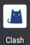

进入 Clash 后，会显示如下界面：

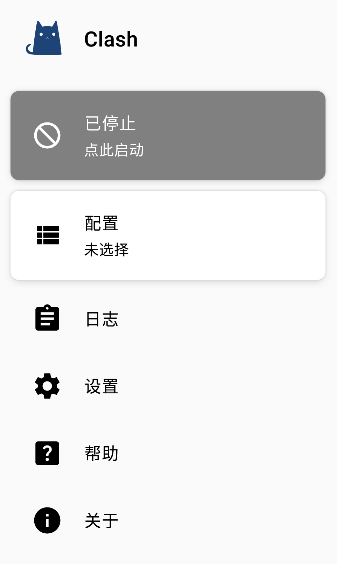

## 添加并设置配置

点击位于界面中上方的“配置”，然后点击右上角的加号，选择“URL（从 URL 导入）”。进入如下界面：

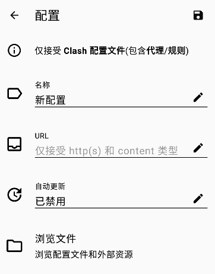

- 配置名称自定，建议填入“一元机场”。

- 复制您的订阅链接，并粘贴到“URL”一行中。

- 不建议禁用自动更新，请点击“已禁用”，填入自动更新时间（建议填入 60） ，并点击“确认”。

<b>所有设置的更改方式为：点击左侧的编辑（铅笔）图标，显示输入框，更改完以后点击确定保存更改。</b>
填入所有推荐设置后应为如下界面：

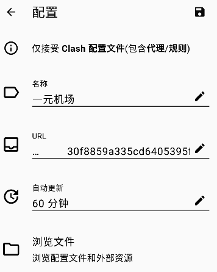

<b>请注意：URL 应填入自己的订阅链接，填入后内容可能与上图的 URL 所示内容不一致。</b>
全部填入后，点击右上角的保存图标保存设置。

如果保存设置失败，请检查：

- 是否连接网络，最好是 Wifi 而不是移动数据。

- 订阅链接填入是否正确。

- 是否已经开启了其它代理。

- 检查此订阅是否对应有效套餐。

- 请稍等一小段时间后再进行几次尝试，根据经验某些机场无法下载可以通过此方式解决。

## 选择节点和模式，开始使用

保存之后会回退到配置界面，界面如下所示：

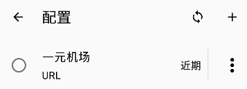

点击选中配置，选中后界面如下所示：

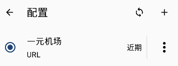

点击配置右侧的省略号，可以进行更新配置、编辑配置等操作。

<b>注意：无论何时，如果遇到大量节点不可用，请先刷新订阅！</b>

点击左上角返回主界面，会出现一个 Clash 想要设置一个 VPN 连接的窗口（如下图所示，各型号手机可能有差异，请以自己的为准），请允许。

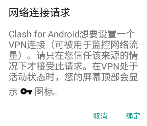

允许之后，代理会默认开启，如下图所示：

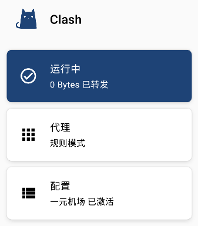

可以点击蓝色的”运行中“将代理关闭。

代理关闭后，如下图所示：

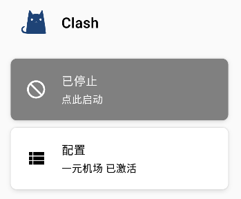

可以再次点击灰色的按钮将其开启。

代理开启后，点击”代理“可以配置代理，点击后界面如下所示：

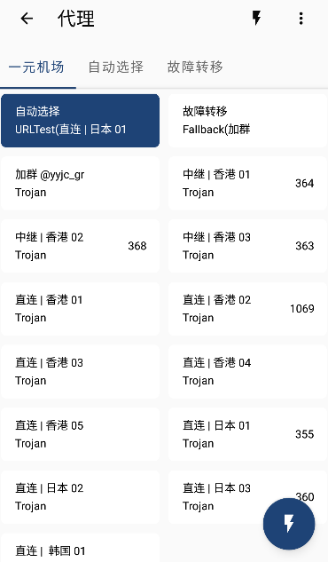

点击右下或者右上的闪电按钮可以测试延迟。

<b>测试延迟仅供检验是否连通，不建议用作速度快慢的参考。</b>

点击右上角的省略号，再点击模式，可以选择代理模式。代理模式列表如下图：

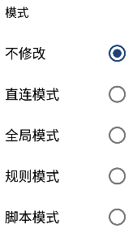

其中常用的是中间三种，仅介绍这三种。

- 若选择全局模式，所有的网站经过代理访问。
- 若选择规则模式，只有国外的网站才会经过代理访问。
- 若选择直连模式，则所有网站都不经过代理。

## ~~Shadowsocks~~

~~- [google Play 下载](https://play.google.com/store/apps/details?id=com.github.shadowsocks&hl=en&gl=US&pli=1)~~

~~- [github 下载](https://github.com/shadowsocks/shadowsocks-android/releases)~~
