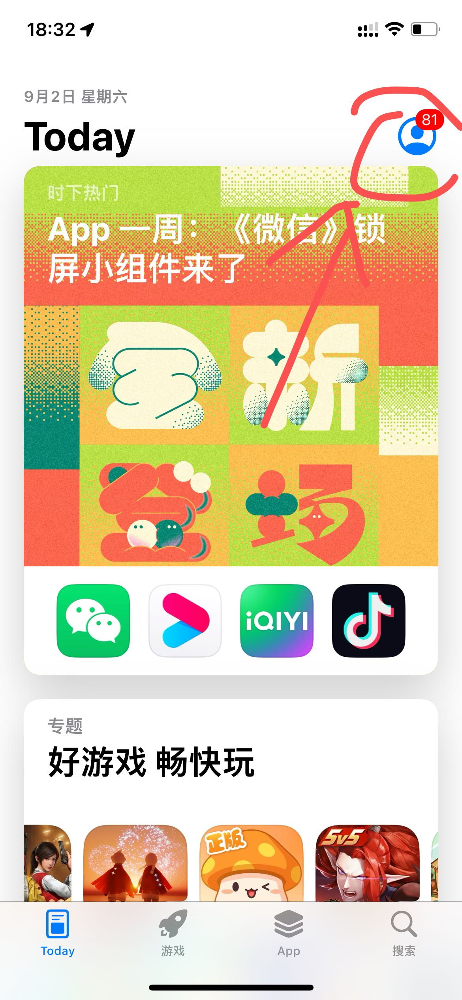
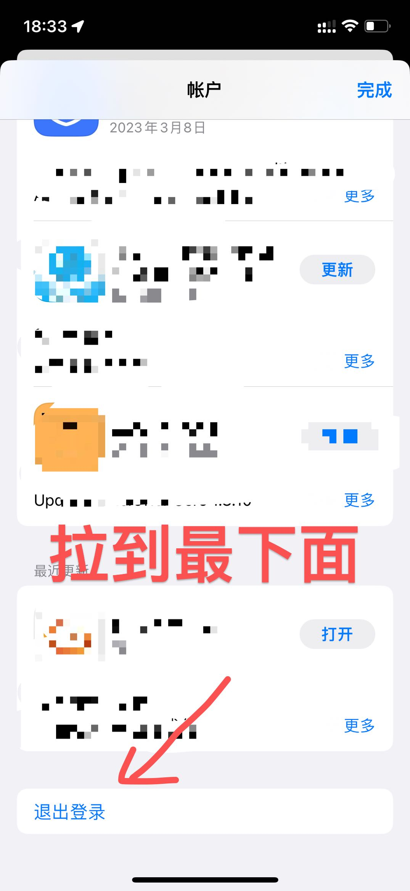
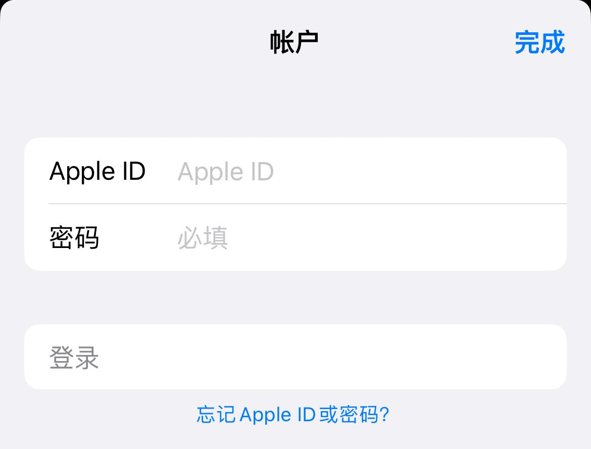
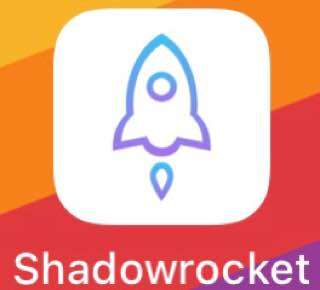
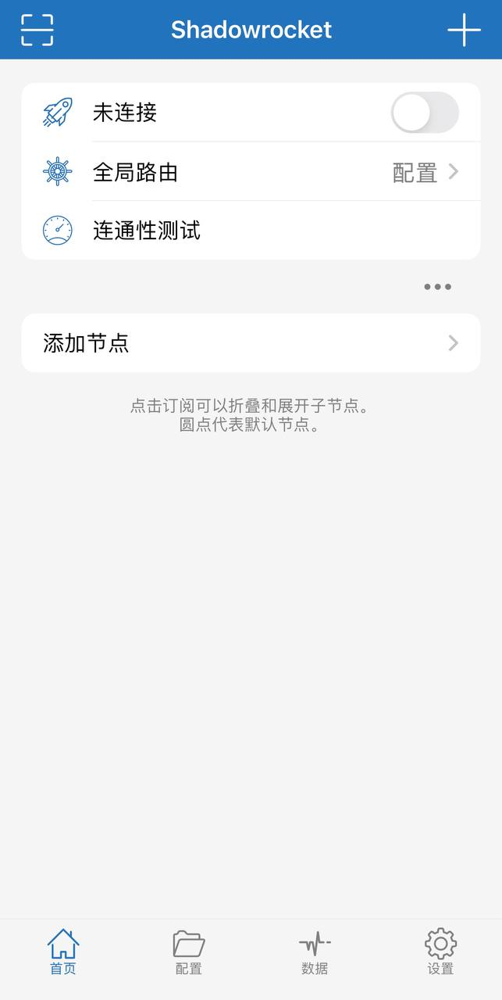
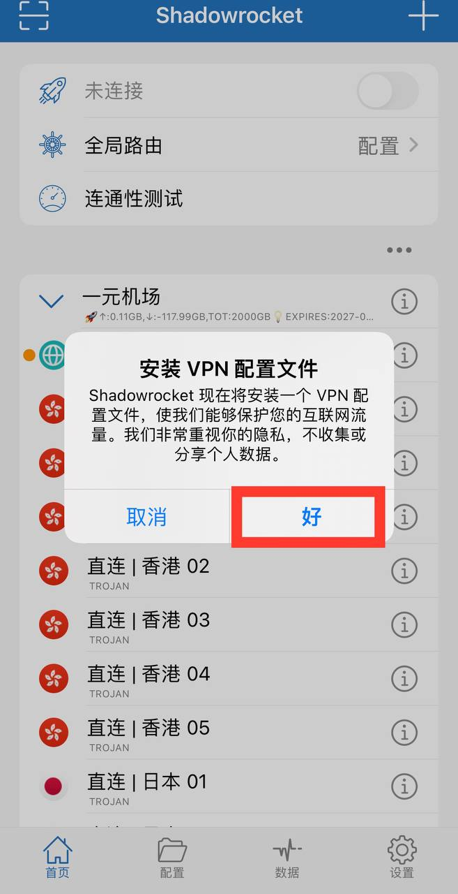
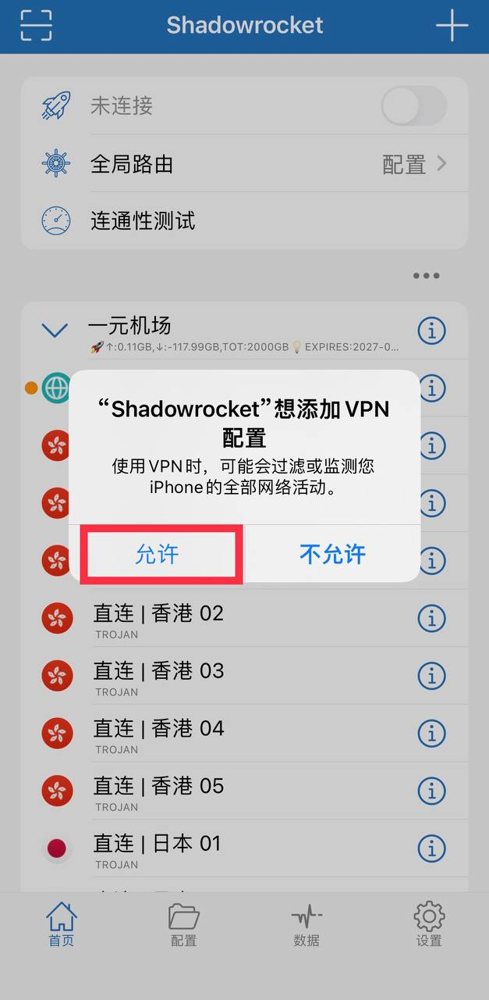
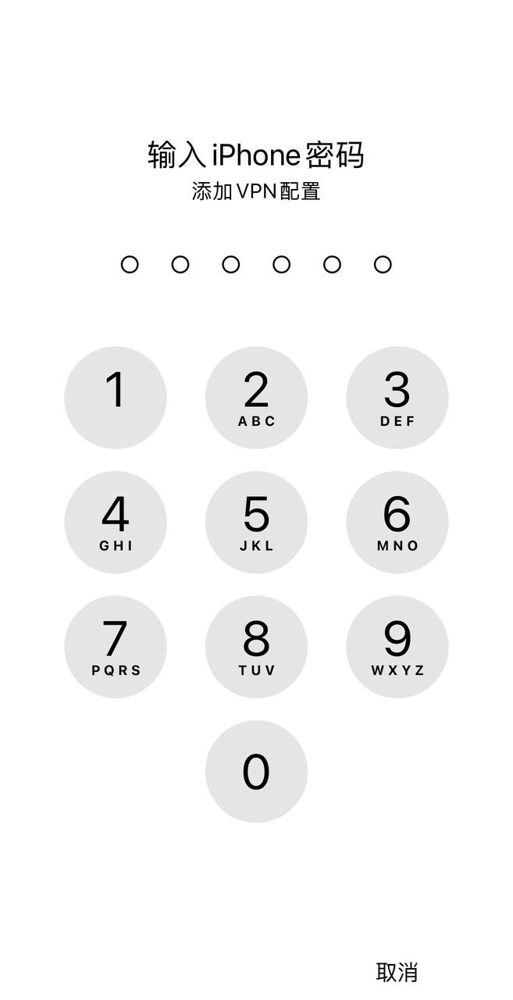
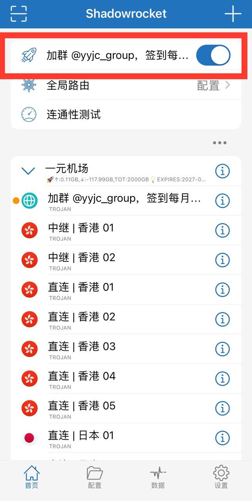
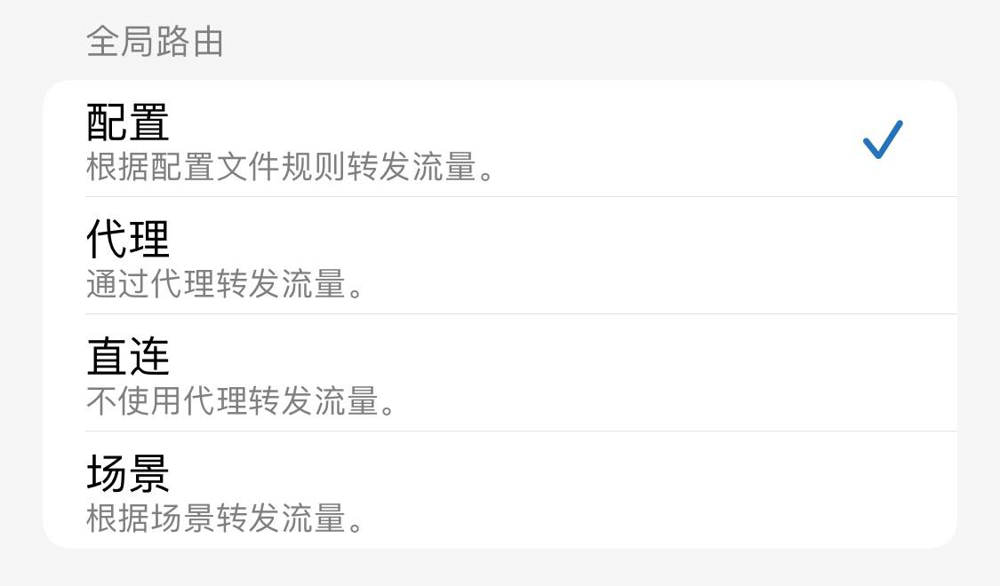

# IOS 设备（iphone、ipad）

### 注意事项

- 以下软件选其一即可（需要非中国区苹果 id 才能下载，最好是美区 id，不懂自行百度）
- 没有非中国区 id，网上找共享 apple id 共享号，或者自己注册（自行搜索教程），然后到 App Store（应用商店）登录，（不是退出设置的 Apple ID！）

  - 打开 App Store（应用商店）右上角头像，拉到最底下，退出登录，即可换 Apple ID 登录

  ::: details 点击查看详情
  
  
  
  :::

## Shadowrocket（常用）

- [App Store 下载](https://apps.apple.com/us/app/shadowrocket/id932747118)

::: details 点击查看使用方法
以下教程将提供 Shadowrocket 最基础的使用方法。

<b>请注意，教程编写时最新版本为 2.2.4，后续版本界面可能会与图片所示内容有所差异，请以最新版本为准</b>

### 1、下载与安装

在安装完毕后，设备上会出现如图所示图标，点击 Shadowrocket。

进入 Shadowrocket，会显示如下界面：

### 2、添加并设置配置

复制节点订阅链接，在软件右上角点击“+”，粘贴订阅链接，保存。然后点击图框位置，安装 VPN 配置文件，点击好，如下图所示。

在弹出“Shadowrocket”想添加 VPN 配置，点击允许，如下图所示。

允许以后将跳转至如图画面（平板相同），输入自己锁屏密码即可。

输入完成后会显示如图画面，代表已开启 VPN。

图中黄点代表现在连接的 VPN，点击想用的 VPN 即可自动切换，点击连通性测速可以测速延迟。

<b>测速延迟仅检验是否连通，不建议用作速度快慢参考。</b>

点击首页上方的全局路由，即可选择代理模式。

代理模式列表如下图：

其中常用的是上面三种，仅介绍这三种

- 若选择配置，只有外国网站才会经过代理访问
- 若选择代理，所有的网站经过代理访问
- 若选择直连，则所有网站不经过代理

如果连接失败，请检查：

- 是否连接网络，最好是 WiFi 而不是移动数据。
- 是否开启了其他代理。
- 检查此订阅是否对应有效套餐。
- 请等待一小段时间后再进行几次尝试，根据经验某些机场无法连接可通过此方法解决。

:::

## Quantumult X

- [App Store 下载](https://apps.apple.com/us/app/quantumult-x/id1443988620)

::: details 使用方法

- [油管教程(需要翻墙)](https://www.youtube.com/watch?v=G1oUtOA1J2w&t=1s)
  :::

## Surge

- [App Store 下载](https://apps.apple.com/us/app/surge-5/id1442620678)
