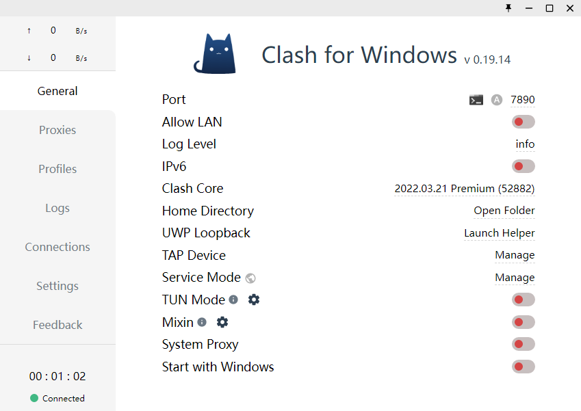

# Windows 系统

Clash for Windows 是 Windows 上流行的客户端，以下教程将提供 Clash for Windows 的基础使用方法。

<b>请注意，教程编写时最新版为 0.19.14，后续版本界面可能会与图片所示内容有所差异，请以最新版为准。</b>

## 下载与安装

- [官网-点击下载](https://github.com/Fndroid/clash_for_windows_pkg/releases)

Clash.for.Windows-0.XX.XX-win.7z（XX.XX 具体随版本号而定）是绿色版，解压即用。

Clash.for.Windows.Setup.0.XX.XX.exe（XX.XX 具体随版本号而定）是安装版，使用前需安装。

<strong>在安装界面，如果出现 Windows 防火墙或杀软警告，请全部允许！</strong>

在安装完毕后，运行"Clash for Windows.exe"，进入如下界面：

## 获取订阅

点击左侧的“Profiles”，进入如下界面：

复制您的订阅链接，并粘贴到界面上方的输入框中，然后点击“Download”按钮。

下载好之后，此界面会出现一个订阅，点击它。

<b>如果发现节点不能使用，请先点击“Update All”按钮更新订阅！</b>

## 选择节点和模式，开始使用

点击左侧的“Proxies”，进入如下界面：

上方的按钮是代理模式，其中 Script 不常用，其它介绍如下：

- Global 是全局代理，若选择此项，所有的网站经过代理访问。

- Rule 是规则代理，若选择此项，只有国外的网站才会经过代理访问。

- Direct 是全部直连，若选择此项，则所有网站都不经过代理。

在选择了代理模式之后，选择一个希望使用的节点，然后回到“General”。

将倒数第二行的“System Proxy”开启，即可打开翻墙。

## 其它

- 如果想要了解更多，请查阅 Clash 文档。

- 请注意：Clash 默认情况下只代理浏览器，若需代理 Windows 应用，请使用 TUN 模式，TUN 模式使用方式请自行查阅。

## 常见问题

- 订阅链接下载报错（出现 `Network Error` 之类的）

  - 关闭软件 vpn 开关，再更新订阅

- 软件各种报错问题（出现 `error`、`fail` 字样）
  - 重新到官网下载最新版本软件 [点击下载](https://github.com/Fndroid/clash_for_windows_pkg/releases)
